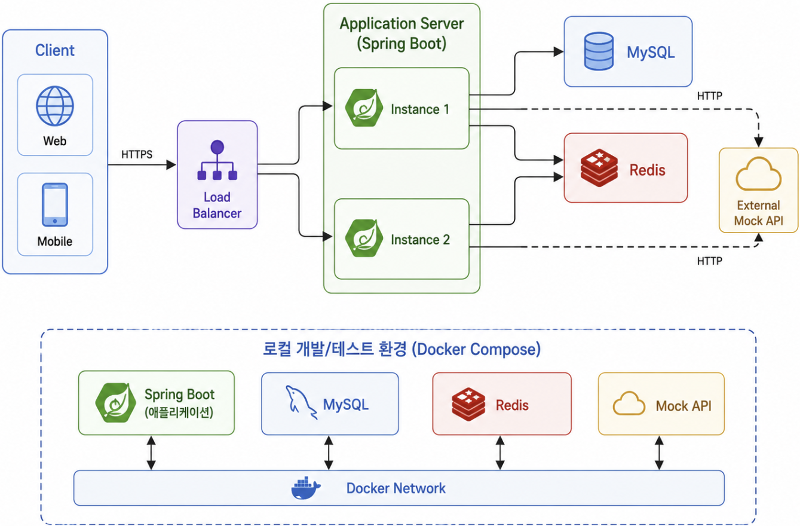
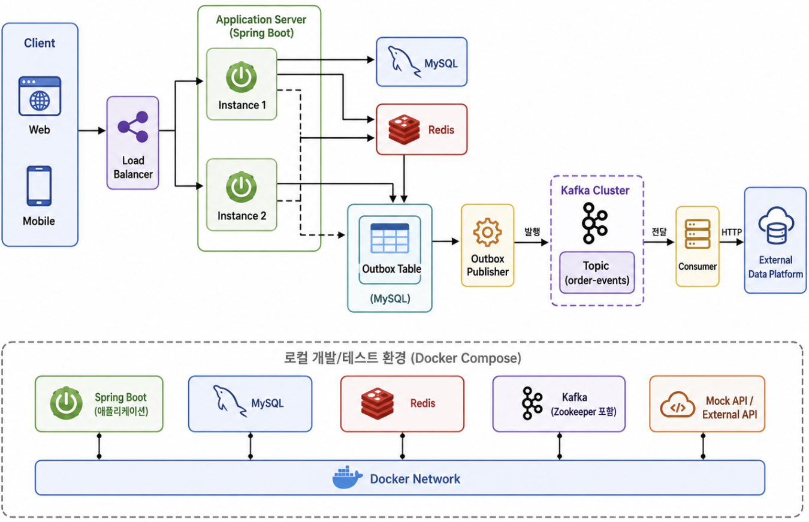

# Architecture

이 문서는 커피 주문 및 포인트 결제 시스템의 전체 구조와  
주문 처리 흐름, 트랜잭션 범위, 동시성 제어 및 외부 이벤트 전송 방식을 정의한다.

구체적인 비즈니스 규칙은 `BUSINESS_RULES.md`,  
데이터 구조는 `ERD.md`,  
API 요청과 응답 형식은 `API_SPEC.md`를 기준으로 한다.

---

# 1. 설계 목표

본 시스템은 다음 목표를 우선한다.

- 주문과 포인트 데이터의 정합성을 보장한다.
- 동일 회원의 동시 주문으로 인한 포인트 초과 사용을 방지한다.
- 주문 중 장바구니 수량이 변경되는 상황을 방지한다.
- 주문 시점의 메뉴 가격과 판매 상태를 기준으로 처리한다.
- 동일 요청으로 주문과 결제가 중복 생성되는 것을 방지한다.
- 다중 애플리케이션 인스턴스 환경에서도 동일하게 동작한다.
- 외부 시스템 장애로 인해 DB 트랜잭션과 락이 오래 유지되지 않도록 한다.
- 1차 동기 전송 구조와 2차 Kafka 비동기 구조를 비교할 수 있도록 한다.

---

# 2. 전체 시스템 구조

## 1차 구현



1차 구현에서는 다음 기능을 제공한다.

- 회원가입 및 JWT 인증
- 메뉴 조회 및 관리
- 장바구니 관리
- 포인트 충전 및 사용
- 장바구니 기반 주문
- 포인트 결제
- 최근 7일 인기 메뉴 조회
- 외부 데이터 수집 Mock API 동기 호출
- 주문 멱등성 및 동시성 제어

## 2차 고도화




2차 고도화에서는 다음 구조를 추가한다.

- Transactional Outbox Pattern
- Kafka Producer
- Kafka Consumer
- 이벤트 발행 재시도
- Consumer 멱등성
- Dead Letter Topic

---

# 3. 애플리케이션 구조

기능별 도메인을 최상위 패키지로 구분한다.

각 도메인 내부는 다음 역할로 나눈다.

```text
controller
dto
entity
repository
service
```

주문처럼 여러 도메인을 함께 사용하는 기능은 `facade`를 추가한다.

```text
Presentation
→ Application
→ Domain
→ Infrastructure
```

## 계층별 책임

| 계층 | 책임 |
|---|---|
| Presentation | HTTP 요청 수신, 입력값 검증, 응답 반환 |
| Application | 하나의 Use Case 실행 및 여러 도메인 조합 |
| Domain | 포인트, 메뉴, 주문 등 핵심 비즈니스 규칙 |
| Infrastructure | MySQL, Redis, Kafka 및 외부 API 통신 |

---

# 4. 패키지 구조

기존 프로젝트에서 사용한 도메인 중심 패키지 구조를 기반으로 한다.

```text
com.example.coffeeorder
├─ CoffeeOrderApplication.java
│
├─ auth
│  ├─ controller
│  ├─ dto
│  │  ├─ request
│  │  └─ response
│  ├─ repository
│  └─ service
│
├─ member
│  ├─ controller
│  ├─ dto
│  │  ├─ request
│  │  └─ response
│  ├─ entity
│  ├─ repository
│  └─ service
│
├─ menu
│  ├─ controller
│  ├─ dto
│  │  ├─ request
│  │  └─ response
│  ├─ entity
│  ├─ repository
│  └─ service
│
├─ cart
│  ├─ controller
│  ├─ dto
│  │  ├─ request
│  │  └─ response
│  ├─ entity
│  ├─ repository
│  └─ service
│
├─ point
│  ├─ controller
│  ├─ dto
│  │  ├─ request
│  │  └─ response
│  ├─ entity
│  ├─ repository
│  └─ service
│
├─ order
│  ├─ controller
│  ├─ dto
│  │  ├─ request
│  │  └─ response
│  ├─ entity
│  ├─ repository
│  ├─ service
│  └─ facade
│
├─ payment
│  ├─ entity
│  ├─ repository
│  └─ service
│
├─ event
│  ├─ dto
│  ├─ client
│  ├─ outbox
│  │  ├─ entity
│  │  ├─ repository
│  │  └─ service
│  └─ kafka
│     ├─ producer
│     └─ consumer
│
└─ common
   ├─ config
   ├─ entity
   ├─ exception
   ├─ response
   ├─ security
   └─ util
```

## 주요 패키지 책임

| 패키지 | 책임 |
|---|---|
| `auth` | 로그인, 로그아웃, JWT 발급 및 재발급 |
| `member` | 회원 정보와 상태 관리 |
| `menu` | 메뉴 조회, 관리 및 인기 메뉴 조회 |
| `cart` | 장바구니와 장바구니 항목 관리 |
| `point` | 포인트 잔액, 충전 및 이력 관리 |
| `order` | 주문 생성, 주문 항목 및 주문 조회 |
| `payment` | 결제 정보와 결제 상태 관리 |
| `event` | 외부 데이터 전송, Outbox 및 Kafka 처리 |
| `common` | 여러 도메인에서 공통으로 사용하는 기능 |

`outbox`와 `kafka` 패키지는 2차 고도화 시 추가한다.

---

# 5. 주문 처리 및 트랜잭션

## 주문 처리 컴포넌트

```text
OrderController
→ OrderFacade
→ OrderTransactionService
→ OutboxEventService

OutboxPublisherScheduler
→ OutboxPublisherService
→ OrderCompletedEventProducer
→ Kafka

OrderCompletedEventConsumer
→ OrderCompletedEventProcessor
→ ExternalOrderEventClient
```

| 구성요소 | 책임 |
|---|---|
| `OrderController` | 주문 요청과 응답 처리 |
| `OrderFacade` | 주문 멱등키 검증과 DB 처리 위임 |
| `OrderTransactionService` | 주문 관련 DB 작업을 하나의 트랜잭션으로 처리 |
| `OutboxEventService` | 주문 완료 Outbox Event 저장, 발행 상태 관리 |
| `OutboxPublisherService` | 발행 가능한 Outbox Event 예약 및 Kafka 발행 |
| `OrderCompletedEventConsumer` | Kafka 주문 완료 이벤트 수신 |
| `OrderCompletedEventProcessor` | Consumer 중복 처리 확인 및 외부 데이터 수집 API 호출 |
| `ExternalOrderEventClient` | 외부 데이터 수집 API 호출 |

## 전체 처리 흐름

```text
[트랜잭션 밖]

JWT 인증
→ 요청 형식 검증
→ Idempotency-Key 형식 검증

        ↓

[하나의 DB 트랜잭션]

기존 멱등 주문 확인
→ 장바구니 잠금 조회
→ 장바구니 항목 검증
→ 메뉴 잠금 조회
→ 메뉴 판매 상태 및 가격 검증
→ 주문 금액 계산
→ 포인트 잠금 조회
→ 포인트 잔액 검증 및 차감
→ 주문 저장
→ 주문 항목 저장
→ 결제 저장
→ 포인트 이력 저장
→ 장바구니 항목 삭제
→ Outbox Event 저장
→ Commit

        ↓

[트랜잭션 밖]

Outbox Publisher와 Kafka Consumer 비동기 처리
```

## 하나의 트랜잭션으로 묶는 데이터

다음 데이터는 일부만 성공하면 정합성이 깨지므로 하나의 트랜잭션으로 처리한다.

- 포인트 차감
- 주문 저장
- 주문 항목 저장
- 결제 저장
- 포인트 이력 저장
- 장바구니 항목 삭제
- Outbox Event 저장

다음 상태는 허용하지 않는다.

```text
포인트만 차감되고 주문이 없는 상태
주문은 있지만 결제 정보가 없는 상태
주문은 있지만 포인트 사용 이력이 없는 상태
주문 총금액과 결제 금액이 다른 상태
주문은 저장됐지만 Outbox Event가 없는 상태
```

외부 API 호출은 네트워크 지연 가능성이 있으므로 트랜잭션에 포함하지 않는다.

---

# 6. 동시성 및 멱등성

## 데이터별 동시성 제어

| 데이터 | 처리 방식 | 목적 |
|---|---|---|
| 장바구니 | 비관적 쓰기 잠금 | 주문 중 수량 변경과 삭제 방지 |
| 메뉴 | 비관적 읽기 잠금 | 주문 검증 중 가격과 상태 변경 방지 |
| 포인트 | 비관적 쓰기 잠금 또는 조건부 UPDATE | 동시 차감과 초과 사용 방지 |
| 주문 멱등키 | DB Unique 제약조건 | 중복 주문 최종 방어 |
| 장바구니 항목 | Unique 제약조건 | 동일 메뉴 중복 행 방지 |

## 잠금 획득 순서

모든 주문 요청은 다음 순서로 잠금을 획득한다.

```text
장바구니
→ 메뉴
→ 포인트
```

여러 메뉴를 잠글 경우 메뉴 ID를 오름차순으로 정렬한다.

잠금 순서를 고정하는 이유는 Deadlock 가능성을 줄이기 위해서이다.

## 포인트 동시성

같은 회원에게 주문 요청이 동시에 들어오면 포인트 행을 순차적으로 처리한다.

```text
초기 잔액: 10,000P

주문 A: 8,000P
주문 B: 7,000P

주문 A
→ 포인트 잠금
→ 8,000P 차감
→ 잔액 2,000P
→ Commit

주문 B
→ 잠금 대기
→ 잔액 2,000P 확인
→ 포인트 부족으로 실패
```

서로 다른 회원은 서로 다른 포인트 행을 사용하므로 병렬 처리가 가능하다.

## 주문 멱등성

주문 요청은 다음 Header를 사용한다.

```http
Idempotency-Key: 550e8400-e29b-41d4-a716-446655440000
```

`orders` 테이블에는 다음 Unique 제약조건을 둔다.

```text
(member_id, idempotency_key)
```

처리 흐름은 다음과 같다.

```text
기존 주문 존재
→ 기존 주문 결과 반환

기존 주문 없음
→ 신규 주문 처리

동일 요청 동시 실행
→ 하나의 INSERT만 성공
→ 나머지는 Unique 제약조건으로 차단
```

---

# 7. 외부 이벤트 전송

## 1차 동기 전송

```text
주문 DB Transaction
→ Commit
→ 외부 Mock API 호출
→ 주문 결과 반환
```

외부 Mock API를 이용해 다음 상황을 테스트한다.

- 정상 응답
- 응답 지연
- HTTP 500
- Timeout

외부 API 호출 실패는 이미 완료된 주문을 Rollback하지 않는다.

```text
주문 Commit 성공
→ 외부 API 실패
→ 주문 상태 COMPLETED 유지
→ `external_order_event_logs`에 실패 로그 기록
```

1차 구조에는 다음 한계가 있다.

- 외부 API 응답시간이 주문 응답시간에 포함된다.
- 외부 API 호출 전에 서버가 종료되면 이벤트가 유실될 수 있다.
- 전송 실패를 안정적으로 복구하기 어렵다.
- 재시도 과정에서 중복 전송될 수 있다.

## 2차 Outbox + Kafka

```text
[주문 트랜잭션]

주문 저장
→ 결제 저장
→ 포인트 차감
→ Outbox Event 저장
→ Commit

        ↓

[별도 처리]

Outbox Publisher
→ Kafka
→ Consumer
→ 외부 데이터 수집 플랫폼
```

주문과 Outbox Event를 동일한 DB 트랜잭션에서 저장한다.

Kafka 발행 실패 시 주문 상태는 변경하지 않고 Outbox Event를 재시도한다.

Consumer는 `eventId`를 기준으로 중복 이벤트를 처리하지 않도록 한다.

## Outbox 저장 및 재처리 기준

- 주문 생성 트랜잭션 안에서 주문, 결제, 포인트 이력, 장바구니 삭제와 함께 `outbox_events`를 저장한다.
- Outbox 저장에 실패하면 주문 트랜잭션 전체를 Rollback한다.
- Outbox Event ID는 Kafka Event ID로 사용한다.
- `(aggregate_type, aggregate_id, event_type)` Unique 제약으로 동일 주문의 `ORDER_COMPLETED` 이벤트 중복 저장을 차단한다.
- Publisher는 `PENDING` 이벤트와 `next_retry_at`이 지난 `FAILED` 이벤트를 생성 순서대로 제한 개수만큼 조회한다.
- Publisher가 이벤트를 조회할 때 DB 쓰기 잠금을 사용하고, 조회한 이벤트의 `next_retry_at`을 짧은 lease 만료 시각으로 변경해 여러 Publisher가 같은 이벤트를 동시에 선택하는 위험을 줄인다.
- Kafka 발행 성공 시 `PUBLISHED`와 `published_at`을 기록한다.
- Kafka 발행 실패 시 `FAILED`, `retry_count`, `next_retry_at`, `last_error`를 기록한다.
- 재시도 한도를 초과해 `next_retry_at`이 없는 `FAILED` 이벤트는 자동 재시도 대상에서 제외하고 운영자가 수동 재처리한다.

## Kafka Consumer 처리 기준

- Consumer는 Kafka 메시지 Key 또는 Payload의 `eventId`를 처리 식별자로 사용한다.
- `processed_kafka_events`에 `eventId`를 저장해 여러 Consumer 인스턴스가 같은 이벤트 처리 여부를 공유한다.
- `COMPLETED` 이벤트가 다시 수신되면 외부 API를 재호출하지 않는다.
- 외부 API 호출 실패나 Timeout은 `FAILED`로 기록하고 Kafka 재시도 정책에 따라 다시 처리한다.
- 최대 재시도 이후 Dead Letter Topic으로 이동한 이벤트는 `dead_letter_order_events`에 원본 Topic, Payload, 실패 원인을 저장한다.
- 외부 API 호출은 Consumer 처리 단계에서 실행하며 주문 DB 트랜잭션에 포함하지 않는다.

---

# 8. 조회, 장애 및 테스트 전략

## 인기 메뉴

인기 메뉴는 외부 데이터 플랫폼이 아니라 내부 완료 주문 DB를 기준으로 한다.

```text
orders
+ order_items
→ 최근 7일 완료 주문 집계
→ Top 3 반환
```

집계 기준은 다음과 같다.

- 완료된 주문만 포함
- 취소된 주문 제외
- 최근 7일 기준
- 주문 수량이 아닌 주문 포함 횟수 기준
- 주문 횟수 내림차순
- 최근 주문 시각 내림차순
- 메뉴 ID 오름차순

초기에는 DB 집계 Query를 사용한다.

이후 데이터가 많아지면 Redis, 집계 테이블 또는 Kafka Consumer 기반 집계를 검토한다.

## Redis 사용 범위

Redis는 다음 용도로 사용한다.

```text
Access Token Blacklist
Refresh Token Whitelist
```

향후 다음 기능에 확장할 수 있다.

```text
인기 메뉴 캐시
멱등키 임시 상태
분산락
Rate Limiting
```

주문과 포인트 정합성의 최종 기준은 MySQL이다.

## 장애 처리

| 상황 | 처리 |
|---|---|
| 포인트 차감 후 주문 저장 실패 | 주문 트랜잭션 전체 Rollback |
| 주문 저장 후 결제 저장 실패 | 주문 트랜잭션 전체 Rollback |
| Commit 후 외부 API 실패 | 주문 유지, 실패 로그 기록 |
| Kafka 발행 실패 | Outbox Event 재시도 |
| Consumer 처리 실패 | 재시도 후 Dead Letter Topic |

## 테스트 대상

다음 동시성 전략을 비교한다.

```text
동시성 제어 없음
낙관적 락
비관적 락
조건부 UPDATE
```

주요 테스트 시나리오는 다음과 같다.

- 동일 회원의 동시 주문
- 여러 회원의 동시 주문
- 포인트 충전과 주문 동시 실행
- 동일 멱등키 동시 요청
- 주문 중 장바구니 변경
- 주문 중 메뉴 가격 변경
- 외부 Mock API 지연 및 장애
- 동기 HTTP와 Kafka 비동기 처리 성능 비교

비교 지표는 다음과 같다.

- 데이터 정합성
- 평균 응답시간
- P95 응답시간
- 처리량
- 락 대기 시간
- 실패 요청 수
- 이벤트 유실 여부
- 이벤트 중복 여부

---

# 설계 결정 요약

| 항목 | 결정 |
|---|---|
| 아키텍처 | 도메인 중심 Layered Architecture |
| 주문 DB 처리 | 하나의 짧은 트랜잭션 |
| 외부 API 호출 | DB Commit 이후 실행 |
| 장바구니 | 비관적 쓰기 잠금 |
| 메뉴 | 비관적 읽기 잠금 |
| 포인트 | 비관적 락 우선, 조건부 UPDATE와 비교 |
| 주문 멱등성 | 회원 ID와 멱등키 Unique 제약 |
| 다중 인스턴스 | 공유 MySQL과 Redis 사용 |
| JVM Lock | 사용하지 않음 |
| 인기 메뉴 | 내부 완료 주문 DB 기준 |
| 1차 외부 전송 | 동기 Mock API |
| 2차 외부 전송 | Outbox + Kafka |
| 이벤트 중복 | Event ID 기반 멱등 처리 |
