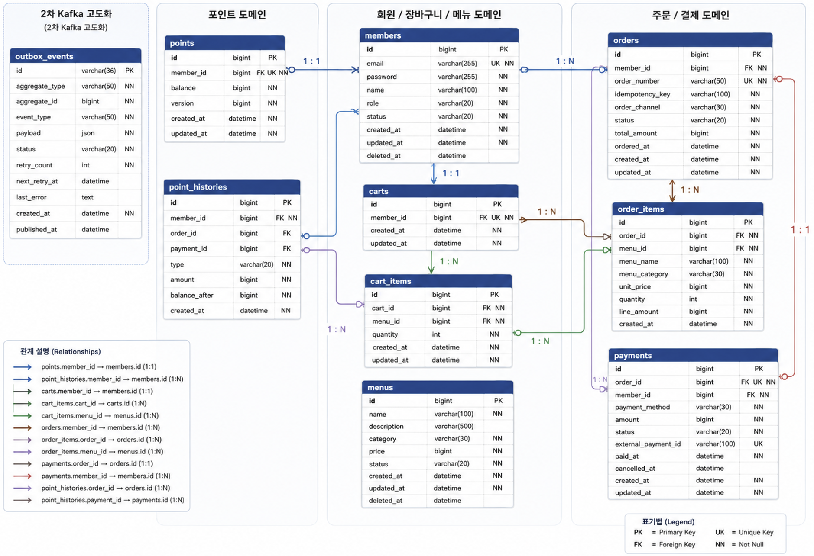

# ERD

이 문서는 커피 주문 및 포인트 결제 시스템의 데이터 구조와
Entity 간 관계를 정의한다.

초기 구현에서는 주문과 포인트의 데이터 정합성을 우선하며,
2차 고도화 단계에서 Transactional Outbox Pattern과 Kafka 기반
이벤트 전송 구조를 추가한다.

---

## 전체 ERD

# 1. 데이터 모델 구성

## 1차 구현

- `members`
- `points`
- `point_histories`
- `menus`
- `carts`
- `cart_items`
- `orders`
- `order_items`
- `payments`
- `external_order_event_logs`

## 2차 고도화

- `outbox_events`
- `processed_kafka_events`
- `dead_letter_order_events`

Kafka와 Redis는 관계형 데이터베이스가 아니므로
ERD 테이블에는 포함하지 않고 별도의 아키텍처 문서에서 관리한다.

---

# 2. 관계 요약

- 회원은 하나의 포인트 계정을 가진다.
- 회원은 여러 개의 포인트 이력을 가진다.
- 회원은 하나의 활성 장바구니를 가진다.
- 장바구니는 여러 개의 장바구니 항목을 가진다.
- 장바구니 항목은 하나의 메뉴를 참조한다.
- 회원은 여러 개의 주문을 가질 수 있다.
- 주문은 여러 개의 주문 항목을 가진다.
- 주문 항목은 원본 메뉴를 참조하며 주문 당시 메뉴 정보를 별도로 저장한다.
- 주문은 하나의 결제 내역을 가진다.
- 1차 구현에서는 주문 완료 후 외부 데이터 수집 Mock API 전송 결과 로그를 가진다.
- 2차 고도화에서는 주문 완료 이벤트를 저장하는 Outbox Event를 가진다.

---

# 3. Members

회원 정보를 관리한다.

| 컬럼 | 타입 예시 | 설명 |
|---|---|---|
| id | BIGINT | 회원 식별자 |
| email | VARCHAR | 로그인 이메일 |
| password | VARCHAR | 암호화된 비밀번호 |
| name | VARCHAR | 회원 이름 |
| role | VARCHAR | 회원 권한 |
| status | VARCHAR | 회원 상태 |
| created_at | DATETIME | 생성 일시 |
| updated_at | DATETIME | 수정 일시 |
| deleted_at | DATETIME | 탈퇴 일시 |

## 제약조건

- `email`은 Unique 제약조건을 가진다.
- 이메일은 소문자로 정규화하여 저장한다.
- 비밀번호는 평문으로 저장하지 않는다.
- 기본 권한은 `USER`이다.
- 기본 상태는 `ACTIVE`이다.
- 회원 탈퇴는 Soft Delete 또는 상태 변경 방식으로 처리한다.

## Enum

### MemberRole

- `USER`
- `ADMIN`

### MemberStatus

- `ACTIVE`
- `INACTIVE`
- `WITHDRAWN`

---

# 4. Points

회원의 현재 포인트 잔액을 관리한다.

| 컬럼 | 타입 예시 | 설명 |
|---|---|---|
| id | BIGINT | 포인트 계정 식별자 |
| member_id | BIGINT | 회원 식별자 |
| balance | BIGINT | 현재 포인트 잔액 |
| version | BIGINT | 낙관적 락 검토용 버전 |
| created_at | DATETIME | 생성 일시 |
| updated_at | DATETIME | 수정 일시 |

## 제약조건

- 회원당 하나의 포인트 계정만 존재한다.
- `member_id`는 Unique 제약조건을 가진다.
- `balance`는 0보다 작을 수 없다.
- 회원가입 시 잔액은 0P로 생성한다.

## 참고

- `version` 컬럼은 낙관적 락 적용 시 사용한다.
- 비관적 락이나 조건부 UPDATE를 최종 채택할 경우 제거할 수 있다.

---

# 5. Point Histories

포인트 충전과 사용 내역을 기록한다.

| 컬럼 | 타입 예시 | 설명 |
|---|---|---|
| id | BIGINT | 포인트 이력 식별자 |
| member_id | BIGINT | 회원 식별자 |
| order_id | BIGINT | 관련 주문 식별자 |
| payment_id | BIGINT | 관련 결제 식별자 |
| type | VARCHAR | 포인트 변동 유형 |
| amount | BIGINT | 변동 포인트 |
| balance_after | BIGINT | 변동 후 잔액 |
| created_at | DATETIME | 발생 일시 |

## 제약조건

- 포인트 충전 또는 사용 성공 시 반드시 이력을 저장한다.
- 충전은 양수, 사용은 음수로 저장한다.
- 주문과 관련 없는 충전 이력은 `order_id`가 Null일 수 있다.
- 포인트 이력은 수정하거나 삭제하지 않는다.

## Enum

### PointHistoryType

- `CHARGE`
- `USE`
- `CANCEL`
- `ADJUST`

초기 구현에서는 `CHARGE`, `USE`를 필수로 구현한다.

---

# 6. Menus

판매할 메뉴 정보를 관리한다.

| 컬럼 | 타입 예시 | 설명 |
|---|---|---|
| id | BIGINT | 메뉴 식별자 |
| name | VARCHAR | 메뉴 이름 |
| description | VARCHAR | 메뉴 설명 |
| category | VARCHAR | 메뉴 카테고리 |
| price | BIGINT | 현재 가격 |
| status | VARCHAR | 판매 상태 |
| created_at | DATETIME | 생성 일시 |
| updated_at | DATETIME | 수정 일시 |
| deleted_at | DATETIME | 삭제 일시 |

## 제약조건

- 가격은 0원보다 커야 한다.
- 카테고리는 필수값이다.
- 삭제된 메뉴는 일반 조회와 주문 대상에서 제외한다.
- 메뉴 삭제는 Soft Delete 방식으로 처리한다.
- 메뉴 변경은 과거 주문 항목에 영향을 주지 않는다.

## Enum

### MenuCategory

- `COFFEE`
- `NON_COFFEE`
- `DECAF`
- `BAKERY`
- `ETC`

### MenuStatus

- `ON_SALE`
- `SOLD_OUT`
- `INACTIVE`

---

# 7. Carts

회원의 활성 장바구니를 관리한다.

| 컬럼 | 타입 예시 | 설명 |
|---|---|---|
| id | BIGINT | 장바구니 식별자 |
| member_id | BIGINT | 회원 식별자 |
| created_at | DATETIME | 생성 일시 |
| updated_at | DATETIME | 수정 일시 |

## 제약조건

- 회원당 하나의 활성 장바구니를 가진다.
- `member_id`는 Unique 제약조건을 가진다.
- 장바구니는 주문 전 임시 데이터로 취급한다.

---

# 8. Cart Items

장바구니에 담긴 메뉴와 수량을 관리한다.

| 컬럼 | 타입 예시 | 설명 |
|---|---|---|
| id | BIGINT | 장바구니 항목 식별자 |
| cart_id | BIGINT | 장바구니 식별자 |
| menu_id | BIGINT | 메뉴 식별자 |
| quantity | INT | 수량 |
| created_at | DATETIME | 생성 일시 |
| updated_at | DATETIME | 수정 일시 |

## 제약조건

- 수량은 1 이상이어야 한다.
- 동일 장바구니에 동일 메뉴는 한 행만 존재한다.
- `(cart_id, menu_id)`에 Unique 제약조건을 둔다.
- 장바구니 항목은 Hard Delete 방식으로 삭제한다.
- 메뉴 가격은 장바구니 항목에 저장하지 않는다.
- 주문 시점에 현재 메뉴 가격을 다시 조회한다.

---

# 9. Orders

주문 대표 정보를 관리한다.

| 컬럼 | 타입 예시 | 설명 |
|---|---|---|
| id | BIGINT | 주문 식별자 |
| member_id | BIGINT | 주문 회원 식별자 |
| order_number | VARCHAR | 외부 노출 주문 번호 |
| idempotency_key | VARCHAR | 중복 주문 방지 키 |
| order_channel | VARCHAR | 주문 진입 채널 |
| status | VARCHAR | 주문 상태 |
| total_amount | BIGINT | 총 주문 금액 |
| ordered_at | DATETIME | 주문 완료 일시 |
| created_at | DATETIME | 생성 일시 |
| updated_at | DATETIME | 수정 일시 |

## 제약조건

- `order_number`는 Unique 제약조건을 가진다.
- `(member_id, idempotency_key)`에 Unique 제약조건을 둔다.
- `total_amount`는 주문 항목 금액의 합계와 일치해야 한다.
- 주문은 수정이나 물리 삭제를 최소화하고 이력 데이터로 보존한다.

## Enum

### OrderChannel

- `WEB_CART`
- `MOBILE`
- `KIOSK`
- `ADMIN`
- `EXTERNAL`

초기 구현에서는 `WEB_CART`만 사용한다.

### OrderStatus

- `COMPLETED`
- `CANCELLED`

## 참고

- 주문 처리 도중 실패한 요청은 트랜잭션 롤백으로 주문 데이터 자체가 저장되지 않을 수 있다.
- 따라서 초기 구현에서는 `FAILED` 상태를 별도 주문 행으로 저장하지 않는다.
- 실패 추적은 애플리케이션 로그 또는 별도 실패 이벤트로 관리할 수 있다.

---

# 10. Order Items

주문에 포함된 메뉴별 정보를 관리한다.

| 컬럼 | 타입 예시 | 설명 |
|---|---|---|
| id | BIGINT | 주문 항목 식별자 |
| order_id | BIGINT | 주문 식별자 |
| menu_id | BIGINT | 원본 메뉴 식별자 |
| menu_name | VARCHAR | 주문 당시 메뉴 이름 |
| menu_category | VARCHAR | 주문 당시 메뉴 카테고리 |
| unit_price | BIGINT | 주문 당시 메뉴 단가 |
| quantity | INT | 주문 수량 |
| line_amount | BIGINT | 항목별 결제 금액 |
| created_at | DATETIME | 생성 일시 |

## 제약조건

- `line_amount = unit_price × quantity`가 성립해야 한다.
- 메뉴 변경이나 삭제와 관계없이 주문 당시 정보를 유지한다.
- 주문 항목은 수정하거나 삭제하지 않는다.

---

# 11. Payments

주문의 결제 정보를 관리한다.

| 컬럼 | 타입 예시 | 설명 |
|---|---|---|
| id | BIGINT | 결제 식별자 |
| order_id | BIGINT | 주문 식별자 |
| member_id | BIGINT | 결제 회원 식별자 |
| payment_method | VARCHAR | 결제 수단 |
| amount | BIGINT | 결제 금액 |
| status | VARCHAR | 결제 상태 |
| external_payment_id | VARCHAR | 외부 결제 식별자 |
| paid_at | DATETIME | 결제 완료 일시 |
| cancelled_at | DATETIME | 결제 취소 일시 |
| created_at | DATETIME | 생성 일시 |
| updated_at | DATETIME | 수정 일시 |

## 제약조건

- 초기 결제 수단은 포인트이다.
- 주문과 결제는 초기 구현에서 1:1 관계를 가진다.
- `order_id`는 Unique 제약조건을 가진다.
- 결제 금액은 주문 총금액과 일치해야 한다.
- 외부 결제 기능 적용 전에는 `external_payment_id`가 Null일 수 있다.
- 결제 데이터는 물리 삭제하지 않는다.

## Enum

### PaymentMethod

- `POINT`
- `CARD`
- `EASY_PAY`
- `GIFT_CARD`
- `MIXED`

초기 구현에서는 `POINT`만 사용한다.

### PaymentStatus

- `COMPLETED`
- `CANCELLED`

---

# 11-1. External Order Event Logs

`external_order_event_logs`는 1차 동기 Mock API 전송 결과를 기록한다.

이 테이블은 전송 성공, 외부 API 실패, Timeout 여부를 확인하기 위한
1차 구현의 관찰용 로그이다.

| 컬럼 | 타입 예시 | 설명 |
|---|---|---|
| id | BIGINT | 로그 식별자 |
| event_id | VARCHAR | 외부 전송 이벤트 식별자 |
| event_type | VARCHAR | 이벤트 종류 |
| order_id | BIGINT | 주문 식별자 |
| member_id | BIGINT | 회원 식별자 |
| status | VARCHAR | 전송 상태 |
| response_status_code | INT | 외부 API HTTP 응답 상태 |
| error_code | VARCHAR | 실패 오류 코드 |
| error_message | VARCHAR | 실패 상세 메시지 |
| attempt_count | INT | 전송 시도 횟수 |
| sent_at | DATETIME | 전송 완료 또는 실패 기록 시각 |
| created_at | DATETIME | 생성 일시 |
| updated_at | DATETIME | 수정 일시 |

## 제약조건

- `event_id`는 Unique 제약조건을 가진다.
- 외부 API 호출은 주문 DB 트랜잭션 Commit 이후 실행한다.
- 외부 API 실패나 Timeout은 완료된 주문 상태를 변경하지 않는다.
- 2차 고도화의 Outbox Event와는 별도 테이블로 관리한다.

## Enum

### ExternalOrderEventStatus

- `SUCCESS`
- `FAILED`
- `TIMEOUT`

---

# 12. Outbox Events

`outbox_events`는 2차 Kafka 고도화 단계에서 추가한다.

주문 완료 후 Kafka로 발행할 이벤트를 데이터베이스에 보관한다.

| 컬럼 | 타입 예시 | 설명 |
|---|---|---|
| id | VARCHAR | 이벤트 고유 식별자 |
| aggregate_type | VARCHAR | 이벤트 대상 도메인 |
| aggregate_id | BIGINT | 주문 식별자 |
| event_type | VARCHAR | 이벤트 종류 |
| payload | JSON | 전송할 이벤트 데이터 |
| status | VARCHAR | 발행 상태 |
| retry_count | INT | 재시도 횟수 |
| next_retry_at | DATETIME | 다음 재시도 시각 |
| last_error | TEXT | 마지막 실패 원인 |
| created_at | DATETIME | 생성 일시 |
| updated_at | DATETIME | 수정 일시 |
| published_at | DATETIME | 발행 성공 일시 |

## 제약조건

- 주문 데이터와 Outbox Event 저장은 동일한 DB 트랜잭션에서 처리한다.
- Outbox Event의 `id`는 Kafka Event ID로 사용한다.
- 동일 주문 완료 이벤트가 중복 저장되지 않도록 `(aggregate_type, aggregate_id, event_type)`에 Unique 제약조건을 둔다.
- Kafka 발행 실패가 주문 완료 상태를 변경하지 않는다.
- `PENDING` 이벤트와 `next_retry_at`이 지난 `FAILED` 이벤트는 Publisher가 재조회할 수 있어야 한다.
- 재시도 한도를 초과한 `FAILED` 이벤트는 자동 조회 대상에서 제외하고 수동 재처리 대상으로 남긴다.
- 수동 재처리는 `FAILED` 이벤트를 `PENDING`으로 되돌리는 상태 변경이며, `PUBLISHED` 이벤트에는 적용하지 않는다.
- 성공한 이벤트도 운영 정책에 따라 일정 기간 보관한다.

## Enum

### OutboxStatus

- `PENDING`
- `PUBLISHED`
- `FAILED`

상태 의미:

- `PENDING`: 아직 발행하지 않았거나 수동 재처리를 위해 다시 대기 중인 이벤트
- `PUBLISHED`: Kafka 발행에 성공한 이벤트
- `FAILED`: 마지막 발행 시도가 실패한 이벤트

---

# 12-1. Processed Kafka Events

`processed_kafka_events`는 Kafka Consumer가 동일한 `eventId`를 중복 처리하지 않기 위한 테이블이다.

| 컬럼 | 타입 예시 | 설명 |
|---|---|---|
| event_id | VARCHAR | Kafka Event ID, 기본키 |
| event_type | VARCHAR | 이벤트 종류 |
| status | VARCHAR | 처리 상태 |
| topic | VARCHAR | 마지막으로 처리한 Topic |
| kafka_partition | INT | 마지막으로 처리한 Partition |
| kafka_offset | BIGINT | 마지막으로 처리한 Offset |
| attempt_count | INT | Consumer 처리 시도 횟수 |
| last_error | TEXT | 마지막 처리 실패 원인 |
| processing_deadline_at | DATETIME | PROCESSING lease 만료 시각 |
| processed_at | DATETIME | 처리 완료 시각 |
| created_at | DATETIME | 생성 일시 |
| updated_at | DATETIME | 수정 일시 |

## 제약조건

- `event_id`는 Primary Key로 관리한다.
- `COMPLETED` 이벤트가 다시 수신되면 외부 API를 재호출하지 않는다.
- `PROCESSING` 이벤트는 `processing_deadline_at`이 지나지 않은 경우에만 처리 중으로 간주한다.
- `processing_deadline_at`이 지난 `PROCESSING` 이벤트는 Consumer 장애 후 재전달된 메시지로 보고 다시 처리할 수 있다.
- `FAILED` 이벤트는 Kafka 재시도 또는 재수신 시 다시 처리할 수 있다.
- 운영 조회 API는 이 테이블을 기준으로 처리 상태, 시도 횟수, 마지막 오류 및 lease 만료 시각을 반환한다.

## Enum

### KafkaEventProcessingStatus

- `PROCESSING`
- `COMPLETED`
- `FAILED`

---

# 12-2. Dead Letter Order Events

`dead_letter_order_events`는 Consumer 최대 재시도 후 Dead Letter Topic으로 이동한 주문 이벤트를 기록한다.

| 컬럼 | 타입 예시 | 설명 |
|---|---|---|
| id | BIGINT | Dead Letter 로그 식별자 |
| event_id | VARCHAR | 원본 이벤트 식별자 |
| original_topic | VARCHAR | 원본 Topic |
| dead_letter_topic | VARCHAR | Dead Letter Topic |
| kafka_partition | INT | Dead Letter Topic Partition |
| kafka_offset | BIGINT | Dead Letter Topic Offset |
| payload | JSON | 원본 Payload |
| failure_reason | TEXT | 최종 실패 원인 |
| received_at | DATETIME | Dead Letter 이벤트 수신 시각 |
| created_at | DATETIME | 생성 일시 |
| updated_at | DATETIME | 수정 일시 |

## 제약조건

- Dead Letter 기록은 주문 상태를 변경하지 않는다.
- 운영자는 저장된 Payload와 실패 원인을 바탕으로 수동 재처리 여부를 판단한다.

---

# 13. Redis 데이터

Redis 데이터는 관계형 ERD에는 포함하지 않는다.

## Access Token Blacklist

- Key: Access Token 식별값 또는 토큰 해시
- Value: 로그아웃 또는 무효화 정보
- TTL: Access Token의 남은 유효기간

## Refresh Token Whitelist

- Key: 회원 또는 세션 식별자
- Value: Refresh Token 또는 토큰 해시
- TTL: Refresh Token 유효기간

---

# 14. Kafka 구조

Kafka는 데이터베이스 테이블이 아니므로 ERD에는 포함하지 않는다.

2차 고도화 시 다음 흐름을 사용한다.

`orders + outbox_events 저장 → Outbox Publisher → Kafka → Consumer`

초기 Topic 예시는 다음과 같다.

- Topic: `order.completed`
- Event Type: `ORDER_COMPLETED`

Kafka Topic, Partition, Event Key, Consumer Group 정책은
`ARCHITECTURE.md`에서 정의한다.

---

# 15. 주요 Unique 제약조건

| 테이블 | 컬럼 |
|---|---|
| members | email |
| points | member_id |
| carts | member_id |
| cart_items | cart_id, menu_id |
| orders | order_number |
| orders | member_id, idempotency_key |
| payments | order_id |
| payments | external_payment_id |

`external_payment_id`의 Unique 제약조건은 외부 결제 기능 도입 시 적용한다.

---

# 16. 데이터 삭제 및 보존 정책

## Soft Delete

- members
- menus

## Hard Delete

- carts
- cart_items

## 수정 및 삭제하지 않는 이력 데이터

- orders
- order_items
- payments
- point_histories

## 운영 정책에 따라 정리하는 데이터

- outbox_events

주문, 주문 항목, 결제 및 포인트 이력은 Soft Delete 대상으로 두기보다
원칙적으로 삭제하지 않는 이력 데이터로 관리한다.

---

# 17. 동시성 및 정합성 고려사항

- 포인트 잔액 변경 시 동시 요청으로 인한 초과 사용을 방지해야 한다.
- 주문, 주문 항목, 결제, 포인트 차감 및 포인트 이력은 하나의 트랜잭션으로 처리한다.
- 2차 고도화에서는 Outbox Event 저장도 동일한 트랜잭션에 포함한다.
- 동일한 멱등키로 여러 요청이 들어와도 주문은 한 번만 생성되어야 한다.
- 장바구니 주문 중 장바구니 데이터가 변경되는 상황을 고려해야 한다.
- 구체적인 Lock과 트랜잭션 전략은 `ARCHITECTURE.md`에서 결정한다.
