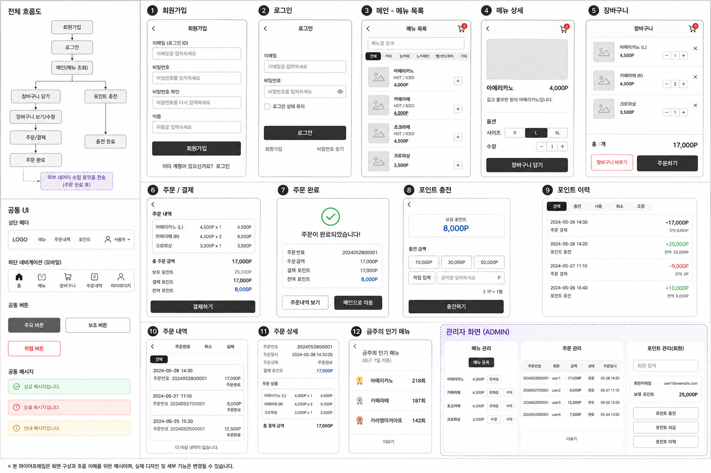

# Wireframe

## 사용자 흐름

회원가입 → 로그인 → 메뉴 조회 → 장바구니 → 주문/결제 → 주문 완료

## 관리자 흐름

관리자 로그인 → 메뉴 등록/수정/삭제 → 주문 조회

## 화면 구성

## 참고

- 본 와이어프레임은 화면 흐름과 기능 확인을 위한 초안이다.
- 실제 UI 디자인 및 세부 구성은 구현 과정에서 변경될 수 있다.
- 주문은 장바구니를 기준으로 진행한다.
- 인기 메뉴는 최근 7일 완료 주문을 기준으로 표시한다.