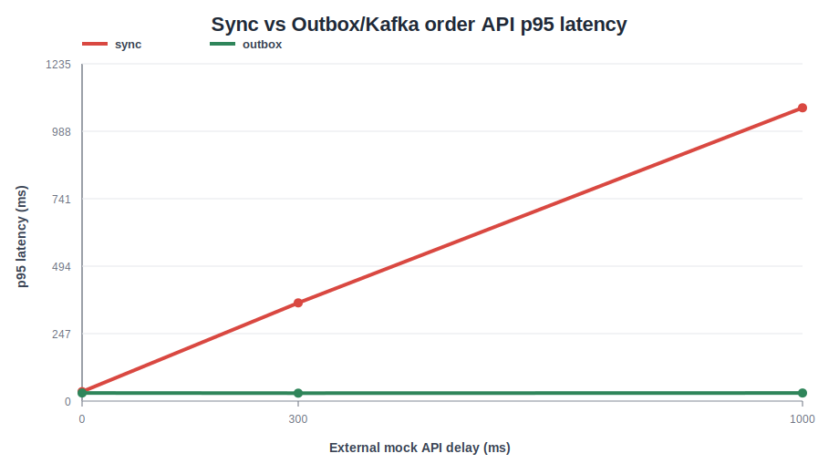

# 주문 이벤트 전송 방식 성능 테스트 결과

이 문서는 `sync`와 `outbox` 주문 이벤트 전송 방식에서 외부 Mock API 지연이
주문 API 응답시간에 미치는 영향을 비교한 로컬 테스트 결과를 기록한다.

비교의 목적은 Kafka 자체가 주문 처리를 빠르게 만든다는 증명이 아니라,
외부 시스템 지연을 사용자 주문 응답 경로에서 분리했을 때 p95 응답시간이 어떻게 달라지는지 확인하는 것이다.

---

## 1. 테스트 환경

| 항목 | 값 |
| --- | --- |
| 테스트 일시 | 2026-07-20 13:49-13:58 KST |
| OS | Microsoft Windows 11 Pro 10.0.26200 |
| CPU | Intel(R) Core(TM) Ultra 9 275HX, 24 cores / 24 logical processors |
| RAM | 31.4GB |
| Java | Gradle Launcher JVM 17.0.12 |
| Gradle | 9.5.1 Wrapper |
| Docker | Client 29.6.1 / Server 29.6.1 |
| MySQL | Docker MySQL 8.4, `localhost:3307` |
| Redis | Docker Redis 7.4, `localhost:6379` |
| Kafka | Docker Apache Kafka 3.7.0, `localhost:9092` |
| 테스트 도구 | k6 v2.0.0 |
| 애플리케이션 인스턴스 | 1 |
| DB 초기 데이터 | `docs/http/00-local-demo-data.sql` |

---

## 2. 테스트 조건

| 항목 | 값 |
| --- | --- |
| k6 VUs | 3 |
| 사용자 수 | 3 |
| 지속 시간 | 30s |
| 메뉴 ID | 9101 |
| 사용자별 충전 포인트 | 1,000,000,000P |
| 장바구니 준비 재시도 | `CART_PREPARE_RETRIES=3` |
| 측정 지표 | `POST /api/v1/orders` 전용 `order_api_duration` |

장바구니 준비 단계는 주문 API 지표에 포함하지 않았다.
준비 단계에서 발생할 수 있는 일시적 5xx는 짧게 재시도하며, 결과 CSV의 `errorRate`는 주문 API 성공 여부만 의미한다.

---

## 3. 실행 모드

### sync

```text
APP_ORDER_EVENT_DELIVERY_MODE=sync
APP_EXTERNAL_ORDER_EVENT_BASE_URL=http://localhost:8080
APP_EXTERNAL_ORDER_EVENT_PATH=/mock/v1/order-events?delayMillis={0|300|1000}
APP_EXTERNAL_ORDER_EVENT_RESPONSE_TIMEOUT_MILLIS=5000
APP_KAFKA_ORDER_EVENT_PUBLISHER_ENABLED=false
APP_KAFKA_ORDER_EVENT_CONSUMER_ENABLED=false
```

### outbox

```text
APP_ORDER_EVENT_DELIVERY_MODE=outbox
APP_EXTERNAL_ORDER_EVENT_BASE_URL=http://localhost:8080
APP_EXTERNAL_ORDER_EVENT_PATH=/mock/v1/order-events?delayMillis={0|300|1000}
APP_EXTERNAL_ORDER_EVENT_RESPONSE_TIMEOUT_MILLIS=5000
SPRING_KAFKA_BOOTSTRAP_SERVERS=localhost:9092
APP_KAFKA_ORDER_EVENT_PUBLISHER_ENABLED=true
APP_KAFKA_ORDER_EVENT_CONSUMER_ENABLED=true
APP_KAFKA_ORDER_EVENT_PUBLISHER_FIXED_DELAY_MILLIS=500
```

---

## 4. 결과

| mode | externalDelayMillis | requests | rps | avgMs | p95Ms | p99Ms | errorRate |
| --- | ---: | ---: | ---: | ---: | ---: | ---: | ---: |
| sync | 0 | 5684 | 184.479 | 26.943 | 34.503 | 43.125 | 0 |
| sync | 300 | 747 | 24.266 | 342.253 | 359.520 | 413.237 | 0 |
| sync | 1000 | 261 | 8.407 | 1050.618 | 1073.711 | 1145.237 | 0 |
| outbox | 0 | 6245 | 203.523 | 22.663 | 29.565 | 35.800 | 0 |
| outbox | 300 | 6174 | 201.291 | 22.790 | 29.017 | 37.960 | 0 |
| outbox | 1000 | 6210 | 202.061 | 22.753 | 29.539 | 41.208 | 0 |



원본 CSV는 `docs/performance/order-event-delivery-results.csv`에 저장했다.

---

## 5. 해석

`sync` 모드는 외부 Mock API 지연이 주문 API 응답시간에 직접 반영됐다.
외부 지연을 0ms에서 300ms, 1000ms로 늘리자 주문 API p95가 각각 34.503ms, 359.520ms, 1073.711ms로 증가했다.

`outbox` 모드는 외부 Mock API 지연을 Kafka Consumer 단계로 분리했다.
외부 지연을 0ms에서 1000ms까지 늘려도 주문 API p95는 29ms 안팎으로 유지됐다.

따라서 이번 로컬 조건에서는 Outbox/Kafka 구조가 외부 시스템 지연을 사용자 주문 응답 경로에서 분리한다는 점을 수치로 확인했다.

---

## 6. 제한 사항

- 단일 로컬 머신, 단일 애플리케이션 인스턴스 기준 결과다.
- 이번 테스트는 최대 처리량 한계 측정이 아니라 외부 지연 분리 효과 확인에 초점을 둔다.
- Kafka Consumer Lag, Broker 지표, Prometheus/Grafana 대시보드 수집은 포함하지 않았다.
- 장바구니 준비 단계의 재시도는 측정 대상인 주문 API p95에서 제외했다.
